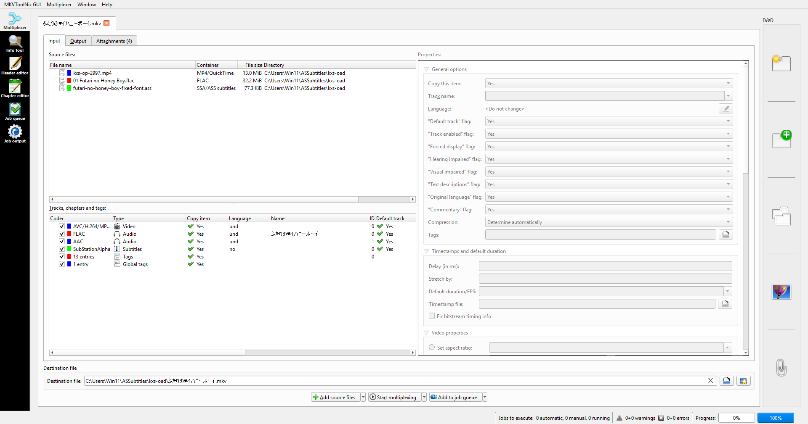
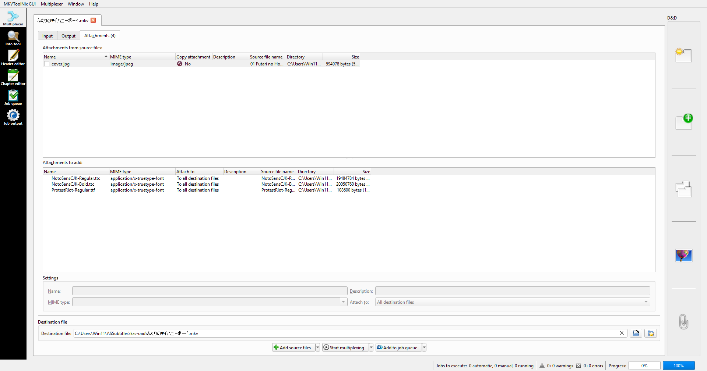
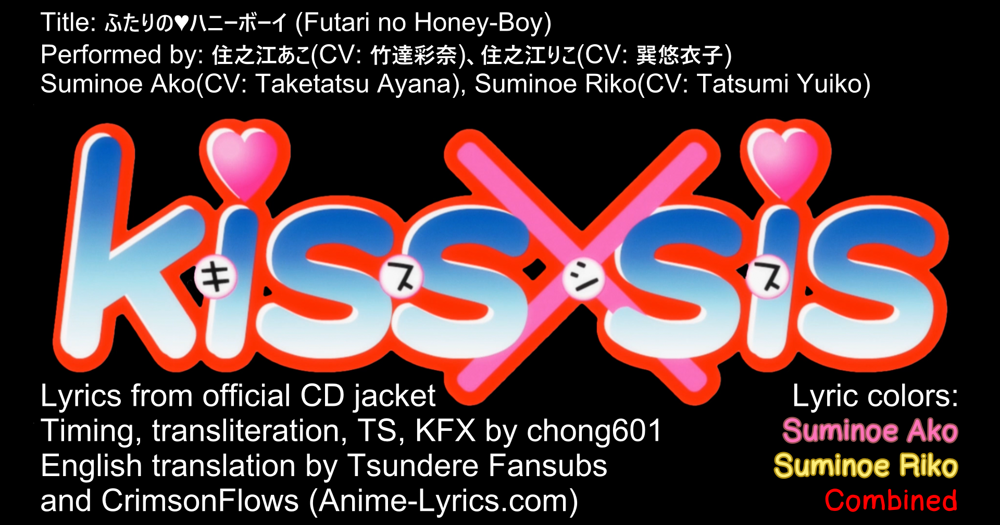
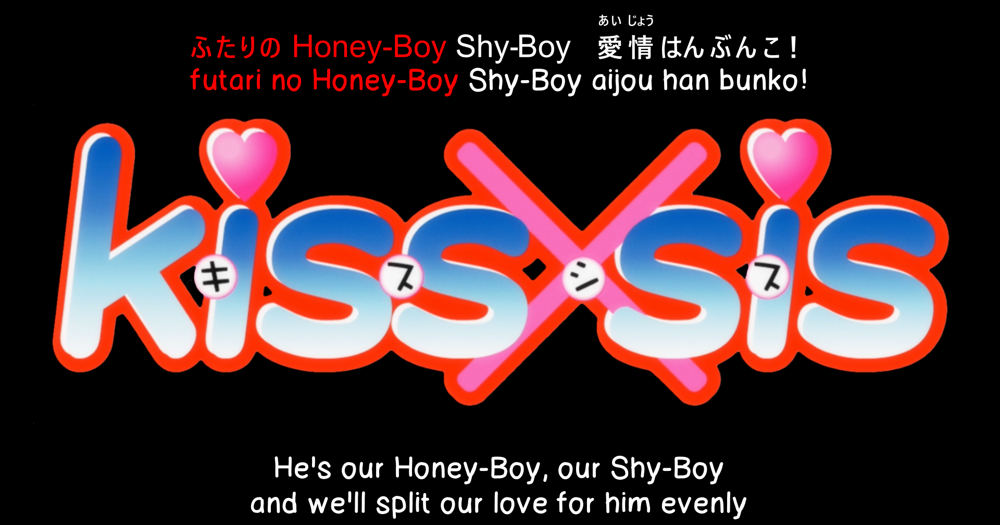
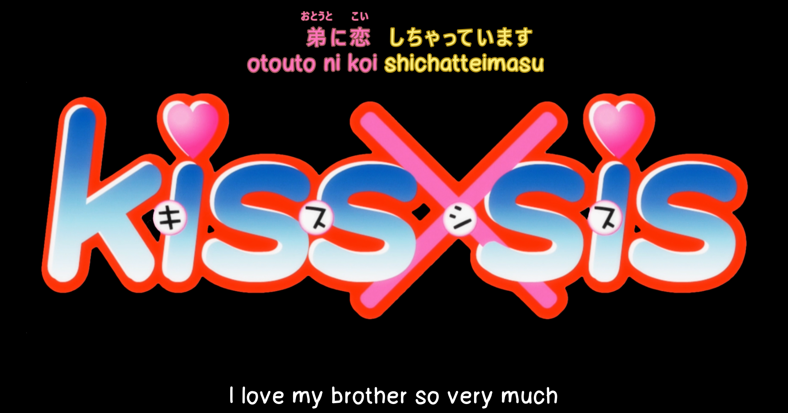
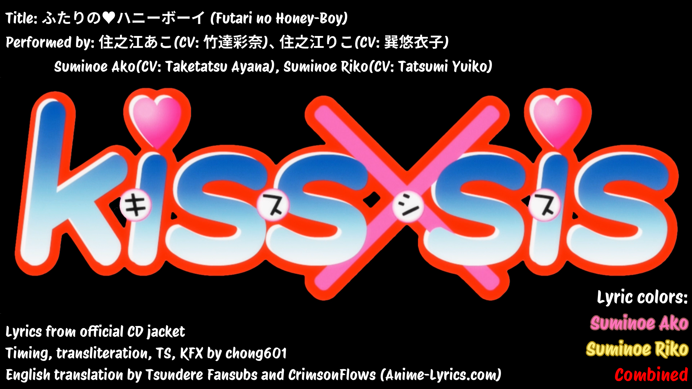
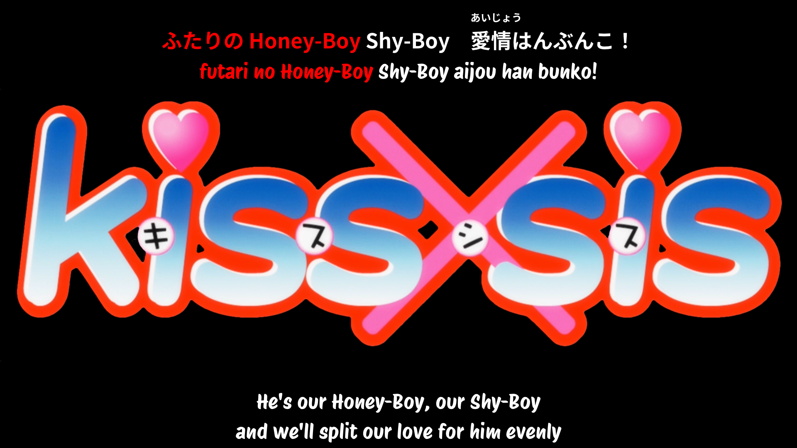
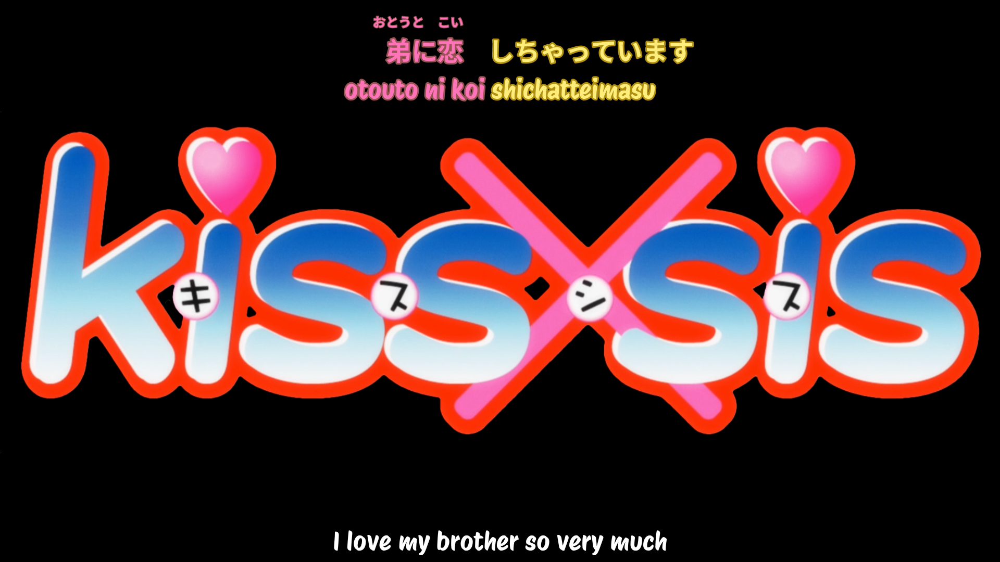

# Kiss x Sis OAD

Why not start with my first manga and anime that I watched back in 2010. What can possibly go wrong?

## Available formats
|Name|Description|Status|
|-|-|-|
|`futari-no-honey-boy-original.ass`|The OG project|Done|
|`futari-no-honey-fixed-font.ass`|OG project, but with better fonts All other defects remain.|Done|
|`futari-no-honey-boy-v2.ass`|Reworked project, by current (2026 May) standards.  Includes performer highlighting.|In progress|

## Project style

What style? It's all improv.

## Notes
All the errors in the original and fixed-font will be preserved as-is. Any PR/issues raised on these two files will be closed as not planned.

It's a reminder why I should read docs before rawdogging Aegisub.

## Source used
- Audio: Official CD
    - No online streaming alternatives available :(
- Japanese lyrics: Official CD jacket image
- Romaji transliteration: Me. (it's bad)
- English translations:
    - Tsundere Fansubs
    - CrimsonFlows (submitted on Anime-Lyrics.com)

## Font selection
- `original`
    - Japanese font: Arial (didn't even try to pick a right font)
      License: Available in Windows.
    - Romaji and English translations: 123Marker
      License: No license, but OK for commercial. DaFont says it's "100% free". Available [here](https://www.dafont.com/123marker.font)
- `fixed-font`
    - Japanese font: Noto Sans CJK JP / Noto Sans JP
      License: SIL OFL, available [here](https://github.com/notofonts/noto-cjk/releases/tag/Sans2.004). Pick "Language Specific OTFs Japanese (日本語)" for the download.
    - Romaji and English font: Protest Riot Regular
      License: SIL OFL, available [here](https://fonts.google.com/specimen/Protest+Riot)

## How to view the subtitles?
- Add the audio file to this project
    Due to obvious reasons, you will have to find your own song source. Anything based on the CD release will work, as long they're in an audio codec that your player can handle.
    - Which is anything today. Players are pretty good. May I suggest mpv?
- Download fonts as defined in `Font Selection`.
    - You will need these later in MKVToolNix
    - Noto Sans JP download is straight from GitHub due to specificity that is this project was built on Linux and they have a different font name compared to Windows.
        - DO NOT SKIP THIS STEP FOR NOTO SANS JP. BUILT IN WINDOWS FONTS DO NOT WORK.
- Extract the fonts to this project directory.
    TODO(chong601): _**create a scratch directory so those files aren't tracked.**_ You will fuck one of the project by uploading copyrighted stuff at some point. Be warned. Past Chong wrote this with 1h of sleep on a fucking Sunday has warned you._
- Install MKVToolNix. You will need this for every project released here.
- Load the `kxs-op-2997.mp4`, the song file and the subtitle file.
    </img>
- Click on Attachments and drag the fonts into the "Attachments to add".
    </img>
    - For Noto Sans, you would want to have the Bold added at minimum (NotoSansCJKjp-Bold.otf) 
        The screenshot is wrong and I assumed it's correct. (.ttc (TrueType Collections) files are not 100% universally supported, only TrueType Font (.ttf) and OpenType Font (.otf) are well supported)
- Click "Start Multiplexing"
- The generated files will be in the path specified in Destination file in Input tab.
- Open the files in a supported player and enjoy the jank. And my regrets not rechecking this work. It's permanent. `original` and `fixed-font` versions are permanently broken by choice of yours truly.

## Screenshots
### `original` (I should fix the boxing issue because this was taken in mpv windowed mode)
</img>
</img>
</img>
### `fixed-font`
</img>
</img>
</img>